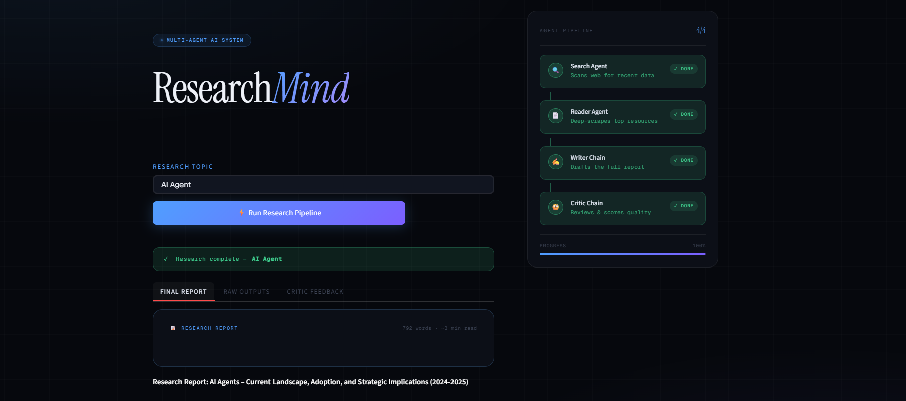

# Multi-Agent AI System for Web Research

This repository contains a Multi-Agent AI System designed for automated web research and data extraction. By combining the search capabilities of Tavily with the precision of BeautifulSoup, the system can autonomously find relevant topics and scrape detailed information to provide comprehensive insights.

## Key Technical Components

1. **Tavily Search Tool**: Used by the primary agent to perform high-quality, AI-optimized searches to retrieve names and URLs related to a specific query.

2. **Scraping Tool (BeautifulSoup)**: A secondary tool that processes the URLs found by Tavily to extract clean, structured content from the web pages.

3. **Agentic Pipeline**: A sophisticated orchestration layer that manages the flow of information between the tools and the reasoning engine.

4. **Streamlit UI**: A clean, interactive front-end for users to input queries and visualize the agent's research process in real-time.

5. **UV Environment**: Managed using uv for lightning-fast, reproducible python environment management.

## Setup and Installation
This project uses uv for environment and dependency management.

Clone the repository:

Bash

    git clone https://github.com/yourusername/multi-agent-researcher.git
    cd multi-agent-researcher

Install dependencies:

Bash

    uv init
    source .venv/bin/activate  # On Windows: .venv\Scripts\activate
    uv sync

Configure API Keys:

Create a .env file and add your credentials:

    TAVILY_API_KEY=your_tavily_key_here
    OPENAI_API_KEY=your_openai_key_here

Run the application:

    streamlit run app.py

# Connect to me 

**Name**: Harsh Kumar

**Email**: harshkumar811h@gmail.com

**LinkedIn**: [Link](https://www.linkedin.com/in/harshkumar-8h/)